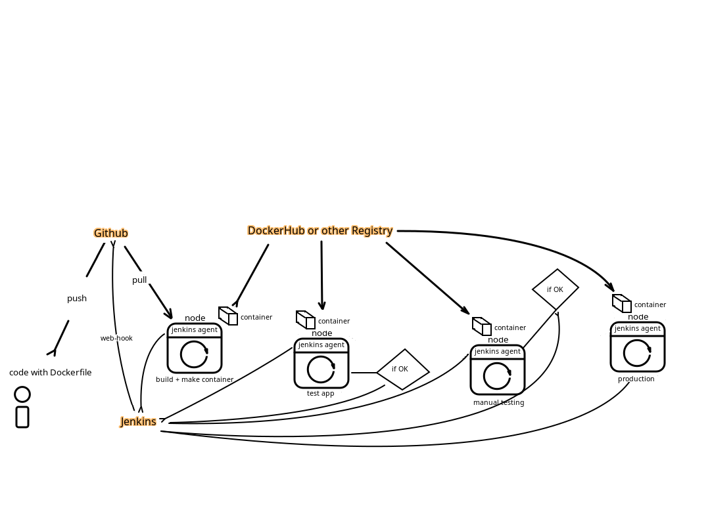

# devops_project

## План

### На железном хосте установить Linux + QEMU\KVM + Libvirt
### Развернуть несколько (5-6) Linux-виртуальных машин при помощи Vagrant
- Их настройку (provisioning) сделать при помощи Ansible, вызывая его из Vagrantfile

### На виртуальные машины установить Kubernates (наверное при помощи Kube-Adm)
- 2-3 Виртуалки использовать под Control-Plane, остальные под Nodes
- как минимум 2 пространства имен (не помню как это в терминалогии Kubernates), для прода и для разработки

### Нужно сюда как то встроить CI\CD куда-нибудь
- Буду использовать Jenkins, в контейнере в том же Kubernates

### 

